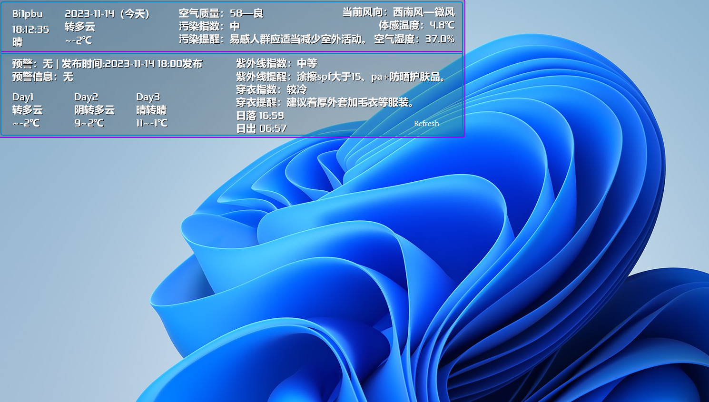

English | [简体中文](README.md)

<!-- Title-->

  

<!-- Badges-->

  
  
  

A desktop widget that displays the weather in real time <a href="/releases">Xiao_Weather_Widget</a> for Windows by using Rainmeter.
 
Especially thanks to Stephi`s SWeather.

- [🔖 Feature](#-feature)
- [🏙️ ScreenShots](#️-screenshots)
- [⬇️ Installation and Using](#️-installation-and-using)
- [🧱 Contribution](#-contribution)
- [Weather API](#weather-api)
- [📝 License](#-license)

## Introduction
**Xiao_Weather_Widget** is a desktop weather widget (hereinafter referred to as the widget) developed by the author in order to beautify the desktop

## 🔖 Feature
- [x] Real-time display of weather information
  - [x] 'Temperature', 'Humidity', 'Wind', 'Pollution Index', 'Warning Information', 'UV Index', 'Traffic Restriction Information', 'Sunrise and Sunset', etc
- [x] Support for Chinese
  - [x] Support for 'English', 'French', 'Spanish', 'Italian', 'Portuguese', 'German', 'Russian' & 'Serbian'
- [x] Support custom fonts, font colors, font sizes
- [x] Support for custom border colors
- [x] Support custom background color, transparency, background image

## 🏙️ ScreenShots
<table>
  <tr>
    <td>
	    
    </td>
    <td>
	    
    </td>
    <td>
	    
    </td>
  </tr>
</table>
<table>
  <tr>
    <td>
	    
    </td>
    <td>
	    
    </td>
    <td>
	    
    </td>
  </tr>
</table>

## ⬇️ Installation and Using
Download Widget [Releases] (https://github.com/xiaochenthu/Xiao_Weather_Widget/releases)  
This widget relies on Rainmeter for support.  
Rainmeter is a free and open source application that manages widgets and modules, you can choose to go to Rainmeter's [official website] (https://rainmeter.net) or its [github repository] (https://github.com/rainmeter/) and install it according to the official introduction. It should be noted that Rainmeter may report an error after the installation is completed, please delete the shortcut to start the program interface and desktop and create a shortcut to use it normally

Once you have installed Rainmeter, you can double-click on the widget to install it.  

**II**. Open Rainmeter in the desktop tray, click on Xiao_Weather_Widget, expand the directory, and find the settings/settings .ini. Here you can set the language, border color, city code, etc. of the interface.  
**III**. Click Divers, double-click the code after Weather Code and City Code to modify, the default is Beijing  
**IV**. Please find the Central Meteorological Observatory and China Weather Network from the source folder or installation directory folder, and the city codes have been saved as .txt in these two folders.  
**V**. After the above steps, restart your computer and connect to the Internet, you should now see the widget showing normal weather information.  
Good luck and have a nice day!

If you know some programming, you can also find **Settings/settings.ini**, **Resources/measures/weather.inc** in the source code or installation directory and modify the content and location that need to be displayed.  
The Languages folder and style.inc are related to the location and style of the language and widgets, respectively. Among them, the setting interface is in English by default, the display language is annotated by default, and the Chinese returned by the Weather API is used, you can select the desired language and cancel the annotation.

## 🧱 Contribution

This widget uses the appearance code of Stephi's SWeather and uses the 6 languages referenced by SWeather

Many weather widgets use the API provided by the wxdata.weather.com, but this API has been deprecated, and SWeather uses the same API without Chinese support. Meantime，wxdata.weather.com serves for America.This part adopts the API provided by the Central Meteorological Observatory and China Weather Network, and supports Chinese, which is more suitable for the physique of Chinese babies.

## Weather API
本The widget uses the API provided by **Central Meteorological Observatory** and **China Weather Network**, which is authoritative, accurate, real-time, and supports Chinese. By default, it is automatically updated every hour, and you can also modify the update frequency in settings/settings.ini.  
Note 1: The API of the Central Meteorological Observatory and China Weather Network should be valid for a long time, but if it fails for some reason, the rest of the API will be invalid and there will be no return value except for the appearance code.  
Note 2: If you want to change the API, you can change the name of the API in settings/settings.ini, but it should be noted that you need to modify the code in measures/weather.inc to adapt to the API you are changing.  
Note 3: The stale data is displayed as empty  
Note 4: This widget annotates the restricted information by default, and can be opened by yourself if necessary. 

## 📝 LICENSE
Because SWeather uses the Creative Commons Attribution-ShareAlike 4.0 International Public License (CC BY-SA 4.0 License), in order to respect Stephi's contribution to this widget, this widget still uses the **CC BY-SA 4.0 License**. You can find the details of this license at [here] (https://creativecommons.org/licenses/by-sa/4.0/).
