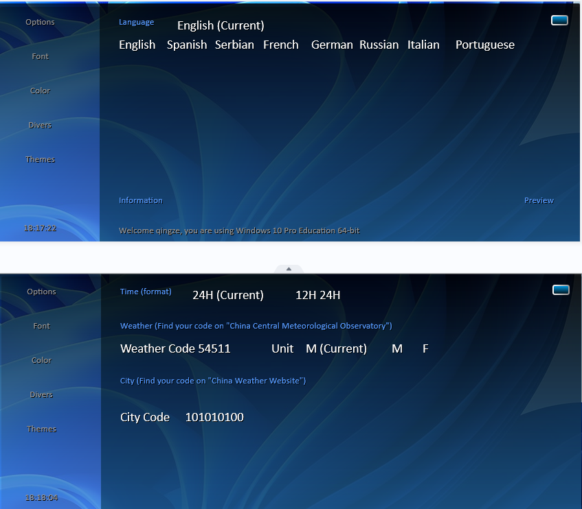

简体中文 | [English](README_en.md)

<!-- Title-->

  

<!-- Badges-->

  
  
  

一款实时显示天气的桌面小部件 <a href="https://github.com/xiaochenthu/Xiao_Weather_Widget/">Xiao_Weather_Widget</a> for Windows by using Rainmeter.
 
Especially thanks to Stephi`s SWeather.

- [🔖 Feature](#-feature)
- [🏙️ ScreenShots](#️-screenshots)
- [⬇️ Installation and Using](#️-installation-and-using)
- [🧱 Contribution](#-contribution)
- [Weather API](#weather-api)
- [📝 License](#-license)

## Introduction
**Xiao_Weather_Widget**是作者为了美化桌面开发的一款桌面天气小部件（以下简称小部件）

## 🔖 Feature
- [x] 实时显示天气信息
  - [x] `温度`，`湿度`，`风力`，`污染指数`，`预警信息`，`紫外线指数`，`限行信息`，`日出日落`等
- [x] 支持中文
  - [x] 支持自定义语言，support for `English`, `French`, `Spanish`, `Italian`, `Portuguese`, `German`, `Russian` & `Serbian`
- [x] 支持自定义字体、字体颜色、字体大小
- [x] 支持自定义边框颜色
- [x] 支持自定义背景颜色、透明度、背景图片

## 🏙️ ScreenShots
<table>
  <tr>
    <td>
	    
    </td>
    <td>
	    
    </td>
    <td>
	    
    </td>
  </tr>
</table>
<table>
  <tr>
    <td>
	    
    </td>
    <td>
	    
    </td>
    <td>
	    
    </td>
  </tr>
</table>

## ⬇️ Installation and Using
下载小部件[Releases](https://github.com/xiaochenthu/Xiao_Weather_Widget/releases)  
本小部件依赖**Rainmeter**提供支持。  
Rainmeter是一款应用并管理小部件（Widgets）和模块（Modules）的免费开源应用，您可以选择去Rainmeter的[官网](https://rainmeter.net)或者其[github仓库](https://github.com/rainmeter/)并根据官方介绍安装。需要注意Rainmeter在安装结束后可能会报错，此时请自行删除开始程序界面和桌面的快捷方式并自行创建快捷方式即可正常使用

**I**.当您安装了Rainmeter后，可直接双击小部件即可安装。  

**II**.在桌面托盘打开Rainmeter，点击Xiao_Weather_Widget，展开目录，找到settings/settings.ini。您可以在这里设置界面的语言，边框颜色，城市代码等。  
**III**.点击Divers,双击Weather Code（中央气象台）和City Code（中国天气网）后的代码即可修改，默认为Beijing  
**IV**.请从源码文件夹或安装目录文件夹中找到中央气象台和中国天气网这两个文件夹，各城市代码已保存为.txt放置于这两个文件夹中。  
**V**.在结束以上步骤后请重启您的电脑并联网，现在您应该看到小部件显示出正常的天气信息了。  
Good luck and have a nice day!

如果您会一些编程，您也可以在源码或安装目录中找到**Settings/settings.ini**, **Resources/measures/weather.inc**这两个文件并自行修改需要展示的内容和位置等。  
**Languages**文件夹和**style.inc**分别与语言及部件的位置和样式有关。其中设置界面默认采用英文，展示语言则默认注释了语言，采用Weather API返回的中文，您可以选择需要的语言并取消注释。

## 🧱 Contribution

本小部件在外观上二改引用了Stephi的SWeather的外观代码，并采用了SWeather所引用的6国Languages

许多天气小组件采用wxdata.weather.com提供的API，然而此API已经被弃用，SWeather同样使用此API，且无中文支持。同时wxdata.weather.com serves for America.本部件采用中央气象台和中国天气网提供的API，且支持中文，更适合中国宝宝的体质。

## Weather API
本小部件使用**中央气象台**和**中国天气网**提供的API,具有权威性，准确性，实时性，且支持中文。默认每小时自动更新一次，您也可以在**settings/settings.ini**中修改更新频率。  
注1：中央气象台和中国天气网的API应是长期有效的，但若因为某些原因失效，则除外观代码外其余部分将失效并无返回值。  
注2：如若您想要更换API，则可以在**settings/settings.ini**中修改API的名称，但需要注意的是，您需要自行修改**measures/weather.inc**中的代码，以适应您所更换的API。  
注3：过时数据显示为空  
注4：本小部件默认将限行信息注释掉了，如需要可自行开启。  

## 📝 LICENSE
因SWeather采用了**Creative Commons Attribution-ShareAlike 4.0 International Public License（CC BY-SA 4.0 License）**，为尊重Stephi对本小部件的贡献，故本小部件仍采用**CC BY-SA 4.0 License**，您可以在[这里](https://creativecommons.org/licenses/by-sa/4.0/)找到该许可证的详细信息。
